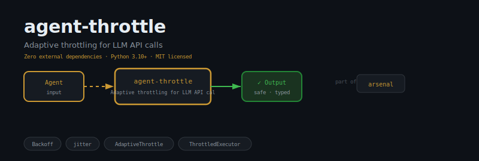
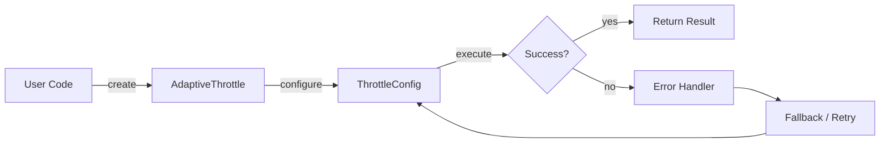
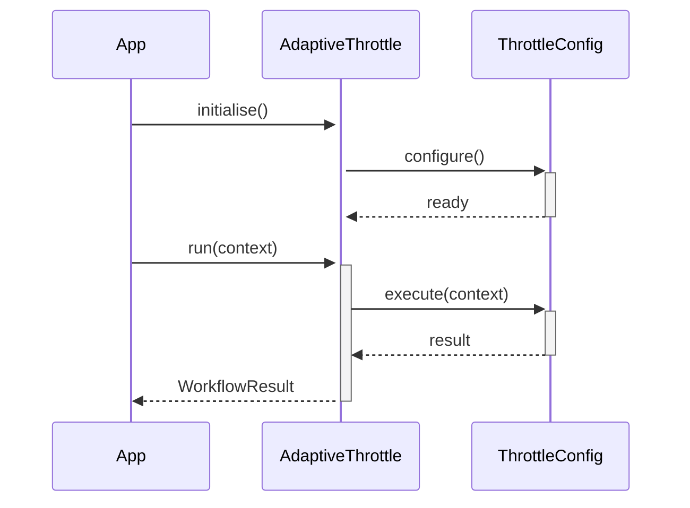

<div align="center">

</div>

# agent-throttle

**Adaptive throttling for LLM API calls — detects 429s and slow responses, adjusts pacing automatically.**

[](https://pypi.org/project/agent-throttle/) [](https://python.org) [](LICENSE) [](#)

---

## The Problem

Without throttling, a burst of agent requests hammers downstream APIs, triggering rate-limit errors and cascading retries. Unbounded concurrency turns a traffic spike into an outage.

## Installation

```bash
pip install agent-throttle
```

## Quick Start

```python
from agent_throttle import AdaptiveThrottle, ThrottleConfig, RateLimitError

# Initialise
instance = AdaptiveThrottle(name="my_agent")

# Use
result = instance.run()
print(result)
```

## API Reference

### `AdaptiveThrottle`

```python
class AdaptiveThrottle:
    """Monitors API response latencies and suggests a throttle delay.
    def __init__(self, target_latency_ms: float = 500.0, window: int = 10) -> None:
    def record(self, latency_ms: float) -> None:
        """Record an observed API latency in milliseconds."""
    def avg_latency_ms(self) -> float:
        """Rolling average latency over the last *window* samples."""
```

### `ThrottleConfig`

```python
class ThrottleConfig:
    """Configuration for Throttle controller.
    def __post_init__(self) -> None:
```

### `RateLimitError`

```python
class RateLimitError(Exception):
    """Raise this inside a wrapped function to signal a 429/rate-limit event.
```

### `ThrottledExecutor`

```python
class ThrottledExecutor:
    """Wraps any callable with adaptive throttling and automatic retries.
    def __init__(
    def __call__(self, *args: Any, **kwargs: Any) -> Any:
```


## How It Works

### Flow



### Sequence



## Philosophy

> Breath control (*prāṇāyāma*) is the original throttle; mastering flow rate is the basis of all regulation.

---

*Part of the [arsenal](https://github.com/darshjme/arsenal) — production stack for LLM agents.*

*Built by [Darshankumar Joshi](https://github.com/darshjme), Gujarat, India.*
